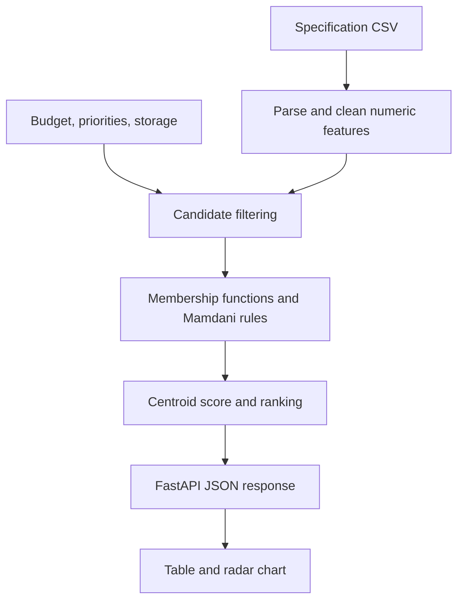

# Smartphone Fuzzy Recommender

**An inspectable, specification-based recommendation API and web interface.**

Compare phones using a Fuzzy Mamdani rule system with budget preference, feature priorities and minimum storage. The project turns messy specification strings into numeric features, ranks candidates and displays a radar comparison. It is an educational decision-support prototype; its scores are not learned purchase probabilities.

**Status:** runnable Python API + static frontend. No verified public deployment. The repository slug is retained to preserve existing links. The implemented method is **Fuzzy Mamdani**, despite the older K-NN repository description.

## Try it

Python 3.12 is used for verification. From the repository root:

```bash
python -m venv .venv
# Linux/macOS
.venv/bin/python -m pip install -r requirements.txt
.venv/bin/python -m uvicorn backend.fuzzy_smartphone_mamdani:app --host 127.0.0.1 --port 8000
```

Windows PowerShell, without activating a script:

```powershell
py -3.12 -m venv .venv
.\.venv\Scripts\python.exe -m pip install -r requirements.txt
.\.venv\Scripts\python.exe -m uvicorn backend.fuzzy_smartphone_mamdani:app --host 127.0.0.1 --port 8000
```

Open [the interface](http://127.0.0.1:8000/ui) or [interactive API documentation](http://127.0.0.1:8000/docs). `/ui` and `/recommend` share an origin. The original standalone HTML also works with the API on port 8000. Bootstrap and Chart.js require internet access. No frontend build step is needed.

## How it works



Mamdani inference expresses overlapping concepts such as medium RAM or high camera resolution without fitting a model to user ratings. It is useful here because the rules can be inspected directly. The trade-off is that memberships and chipset scores are hand chosen; user relevance has not been validated.

- AND and implication use minimum; OR and aggregation use maximum.
- The output universe has 1,001 points between 0 and 100; defuzzification uses a discrete centroid.
- If no rule fires, a weighted specification heuristic supplies the score.
- Storage is a hard minimum. Budget is a **soft preference**: fewer than 20 candidates in the selected price band causes the price filter to fall back to all storage-qualified phones.
- Ties use launch year, processor score, RAM, battery and storage, in that order.

See [method and membership definitions](docs/METHOD.md), [API examples](docs/API.md) and [data provenance](docs/DATA.md).

## API at a glance

| Route | Purpose |
| --- | --- |
| `GET /` | API identity |
| `GET /ui` | Browser interface |
| `GET /health` | Dataset loading check |
| `GET /meta` | Available brands, categories and row count |
| `POST /recommend` | Up to 20 ranked candidates |
| `GET /docs` | Generated OpenAPI documentation |

```json
{"budget":"medium","priority":["Camera","Battery"],"min_storage":256}
```

Results include rank, brand, model, score, category, price in launch USD, storage in GB, and normalized radar values. Invalid preferences return HTTP 422; a valid request with no eligible phones returns `EMPTY` with an empty list.

## Engineering evidence

[Verification record](docs/VERIFICATION.md) distinguishes local checks, CI and browser checks. Tests cover real-dataset ranking, input rejection, empty candidates, storage extraction and unchanged fuzzy membership definitions. The fixed output memberships are cached; this removes repeated curve generation without changing the rule system.

```bash
python -m pip install -r requirements-dev.txt
python -m pytest -q
python -m ruff check backend tests
python -m compileall -q backend
```

## Repository map

- `backend/fuzzy_smartphone_mamdani.py` — parsing, fuzzy engine, CLI and API.
- `frontend/index.html` — preference form, ranking table and radar chart.
- `dataset/` — existing 2025 specification CSVs; original provenance remains unresolved.
- `tests/` — behavioral regression tests.
- `docs/` — method, API, data and verification.
- `render.yaml`, `Procfile` — existing deployment configuration, not deployment evidence.

The historical `.txt` snapshots and tracked bytecode are retained to preserve existing files. The `.py` and `.html` files are the executable sources; `.gitignore` prevents newly generated bytecode from being added.

## Limitations and next work

1. Document the dataset's original URL, author, version and redistribution permission before expanding distribution.
2. Evaluate ranking relevance with labeled preferences; no recommendation-accuracy claim is made.
3. Replace chipset and camera megapixel heuristics with measured, sourced comparisons.
4. Expose budget fallback visibly and add a strict-budget option.
5. Review network-facing deployment, rate limits and safe error responses before public hosting.

Launch prices are historical, not current prices or availability. The launch-year memberships stop at 2026. The API is unauthenticated and intended for local evaluation. No license has been added because the owner has not selected one. See [asset requests](ASSET_REQUESTS.md).
